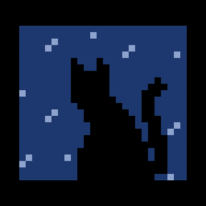

  

 

  

  

  

 

  

  

    <strong>A blank canvas doesn’t ask for perfection. It asks for imagination.</strong>  
    I like exploring new ideas, trying things I haven’t done before, and turning curiosity into something worth creating.
  

  

<!-- GITHUB SNAKE -->

  <picture>
    <source
      media="(prefers-color-scheme: dark)"
      srcset="https://raw.githubusercontent.com/rainniel2/rainniel2/output/github-snake-dark.svg"
    />
    <source
      media="(prefers-color-scheme: light)"
      srcset="https://raw.githubusercontent.com/rainniel2/rainniel2/output/github-snake.svg"
    />
    
  </picture>

