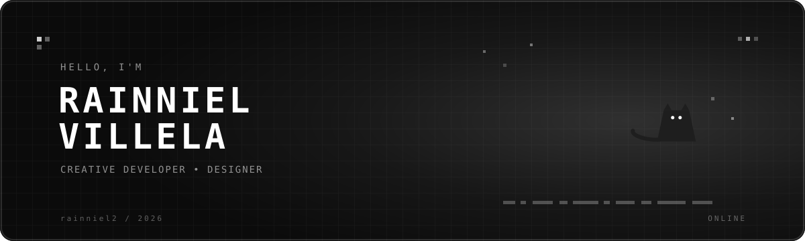

<div align="center">
  
</div>

<p align="center">
  <a href="YOUR_FACEBOOK_URL">
    
  </a>
  <a href="YOUR_INSTAGRAM_URL">
    
  </a>
  <a href="YOUR_X_URL">
    
  </a>
  <a href="mailto:YOUR_EMAIL@gmail.com">
    
  </a>
</p>


<p align="center">
  <picture>
    <source
      media="(prefers-color-scheme: dark)"
      srcset="https://raw.githubusercontent.com/rainniel2/rainniel2/output/github-snake-dark.svg"
    />
    <source
      media="(prefers-color-scheme: light)"
      srcset="https://raw.githubusercontent.com/rainniel2/rainniel2/output/github-snake.svg"
    />
    
  </picture>
</p>
```
